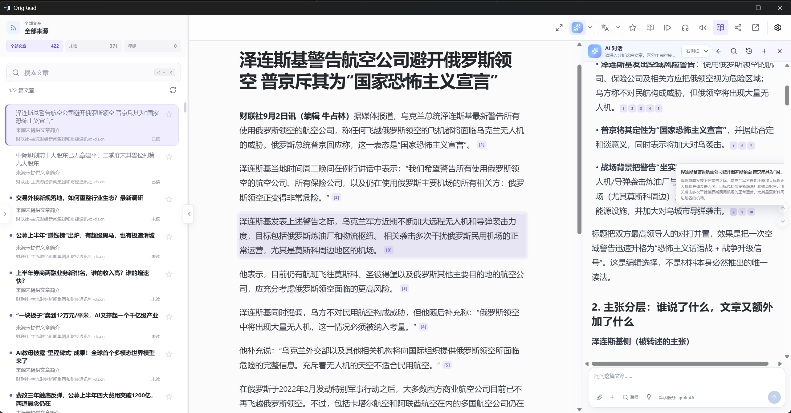

<div align="center">
  
  <h1>原读 Desktop · OrigRead Desktop</h1>
  <p><strong>读你关心的，回到信息的出处。</strong></p>
  <p>面向 Windows、macOS 与 Linux 的阅读器，让订阅、全文阅读与 AI 辅助自然地连在一起。</p>
  <p><a href="README.md">English</a> · 简体中文</p>
  <p>
    <a href="https://github.com/ZGMFX01A/OrigRead-Desktop/releases/latest"></a>
    
    
    
    <a href="LICENSE"></a>
    
    <a href="https://github.com/ZGMFX01A/OrigRead-Desktop/stargazers"></a>
  </p>
  <p>
    <a href="https://github.com/ZGMFX01A/OrigRead-Desktop/releases/latest"><strong>下载桌面版</strong></a> ·
    <a href="USER_GUIDE-zh-CN.md">操作手册</a> ·
    <a href="https://github.com/ZGMFX01A/OrigRead">Android 版</a> ·
    <a href="https://github.com/ZGMFX01A/OrigRead-Desktop/issues">反馈问题</a>
  </p>
</div>

## 把值得读的，留一张桌面

喜欢的博客、持续关注的新闻、偶尔更新的专栏，都可以有一个固定的阅读去处。原读把你选择的来源汇成时间线，让你按自己的兴趣和节奏阅读。

在电脑上，文章和 AI 可以并排放下：一边读原文，一边提问、比较和核对引用。需要细读时，收起列表，调整字体和版心；想留下笔记，就把整理好的文章复制出去。**从发现内容到理解内容，原文始终在手边。**

<p align="center">
  
  <br /><sub>文章与 AI 同屏 · 读到结论，随手核对出处</sub>
</p>

## Citation：让回答的依据看得见

读到 AI 给出的结论，你可能还想确认：作者真的这么说了吗？这句话在什么语境里？两篇报道的依据是否相同？Citation 把回答和原文中的证据连起来，让核对成为阅读的一部分。

**点引用，找到原话。** 回答中的文章引用可以直接点击，原读会定位并高亮对应正文。依据来自另一篇附加文章时，也能切过去查看，同时保留这次讨论。文章和回答放在同一窗口里，读过上下文，再继续追问，思路更容易接得上。

比如，把两篇关于同一件事的报道交给 AI，问“它们在哪些地方说法不同？”沿着引用查看两边的原话，就能进一步判断分歧来自事实、立场，还是表述方式。**AI 帮你整理线索，引用让你自己判断。**

历史回答会保留当时使用的来源；后来增删附件，不会替换旧回答的依据。搜索结果和工具结果也各自保留出处。文章改写或引用无法准确定位时，可以查看来源信息；有引用仍不代表 AI 的理解一定正确。

具体操作见[手册中的 Citation 章节](USER_GUIDE-zh-CN.md#citation核对回答的依据)。

## 没有 RSS，也值得订阅

喜欢的网站没有订阅按钮，不一定就得每天自己去刷。**原读会尝试把网站里持续更新的内容，变成可以追踪的订阅。** 粘贴首页或栏目页，它会寻找 RSS / Atom、匹配 RSSHub 路由；没有现成 Feed 时，还能从网页文章列表或公开 JSON/API 中寻找内容。WordPress 的文章接口，以及部分 Next.js、Nuxt 网页中自带的文章数据，也在支持范围内。

你不必先选懂一套解析方式。原读会检查文章数量、标题、链接和时间等信息，将更合适的候选排在前面，再由你选中真正想追踪的栏目。需要执行网页脚本后才出现的内容，也有浏览器渲染作为补充尝试。

对于需要特别处理的网站，可以用解析规则告诉原读“文章在哪里”。规则支持导入、导出，也可以请 AI 帮忙生成，**先看实际解析出的文章，再决定是否保存**。日常发现和解析无需配置 AI；订阅能否稳定更新，仍取决于网站的访问条件和结构，改版后可能需要调整规则。

还没想好读什么，可以逛逛内置来源目录；已有一批订阅，也可以直接导入 OPML。添加方法和解析问题的处理见[操作手册](USER_GUIDE-zh-CN.md#添加一个来源)。

<table>
  <tr><th width="50%">找到想追踪的栏目</th><th width="50%">调整成习惯的阅读方式</th></tr>
  <tr>
    <td align="center"></td>
    <td align="center"></td>
  </tr>
</table>

## 从订阅到读懂，少一点来回折腾

### 给长文章留出空间

只有几行摘要的 Feed，可以尝试提取全文；想看评论、图表或互动内容，随时在应用内打开原始网页。字体、字号、背景和版心都可以按习惯调整，也支持导入本地字体。

AI 面板可以放在正文左侧或右侧，拖动边缘就能调整宽度。键盘也能完成切换文章、收藏、搜索和进入专注阅读等常用操作，让连续阅读更顺手。

### 看懂，也留得下来

外语文章可以查看译文或双语内容，翻译可选 Microsoft Translator、DeepL、Google Cloud、DeepLX / DLX 兼容服务或 AI 模型。想换种方式阅读，就让 TTS 读给你听。

想留进笔记，点击分享即可将文章复制为 Markdown；正文、当前打开的译文和摘要可以按需附带，原文链接始终保留。粘贴到常用笔记软件，之后重读或整理时仍能找到出处。

### AI 接着你的阅读往下走

长文可以先看摘要，有疑问就问当前文章，或选中一段文字继续追问。需要对照不同观点时，附加几篇相关文章；需要背景或近期进展时，再使用联网搜索。

原读支持 OpenAI 兼容服务，可使用你选择的云端模型、自建服务或本地模型服务。快捷消息保存常问的问题，Skills 保存分析方法，自定义指令保留回答偏好。需要更多工具时，可以连接远程 MCP 或本机 MCP 服务，工具执行前会请你确认。

这些都可以按需配置。日常订阅、全文提取和阅读无需 AI，先读起来，遇到需要它的时候再用就好。进阶设置见 [AI、搜索与工具指南](AI_MCP_SKILLS-zh-CN.md)。

## 下载与开始使用

从 [GitHub Releases](https://github.com/ZGMFX01A/OrigRead-Desktop/releases/latest) 选择与你的系统匹配的安装包：

| 系统 | 安装包 |
| --- | --- |
| Windows 10 / 11 · x64 | `.exe` 安装程序 |
| macOS 13+ · Apple Silicon | `.dmg` |
| Linux · x64 | `.AppImage`；Ubuntu / Debian 也可使用 `.deb` |

安装后，保留默认 Local 账户，添加一个来源或导入 OPML，就可以开始阅读。应用内支持检查更新；安装遇到问题时，查看[安装与更新说明](USER_GUIDE-zh-CN.md#安装与更新)。

手机和平板请前往 [OrigRead Android](https://github.com/ZGMFX01A/OrigRead)。Android 与桌面端独立安装、分别更新；跨端迁移的内容和范围见[操作手册](USER_GUIDE-zh-CN.md#opml备份与迁移)。

## 自己的订阅，自己掌握

使用 Local 账户，数据保存在本机，也能使用网页解析、JSON/API 和 RSSHub 等扩展来源。已有 FreshRSS、Google Reader Compatible 或 Fever Compatible 服务时，可以连接对应账户，同步服务支持的订阅和阅读状态。

常规解析、正文提取和过滤在本机完成。使用 AI 或云翻译时，相关内容会发送到你配置的服务。配置备份可以带走订阅、规则和设置，敏感凭据默认不导出，需要迁移时可用密码加密。**配置备份不包含文章正文、已读和收藏历史，也不包含摘要和翻译缓存。**

## 反馈与交流

使用中遇到问题，或有想改进的地方，欢迎[提交 Issue](https://github.com/ZGMFX01A/OrigRead-Desktop/issues)。解析问题请附上网址、应用版本和复现步骤。项目目前不接受 Pull Request，功能建议、翻译和文档纠错也请通过 Issue 反馈。

<details>
<summary>从源码构建</summary>

环境要求：Node.js 24+、npm 11+。

```bash
npm ci
npm run typecheck
npm test
npm run build
```

按目标平台打包：

```bash
npm run package:win
npm run package:mac
npm run package:linux
```

构建脚本与安装包配置见 [package.json](package.json) 和 [electron-builder.yml](electron-builder.yml)。

</details>

## 项目关系与许可证

OrigRead Desktop 与 [OrigRead Android](https://github.com/ZGMFX01A/OrigRead) 共享产品方向，代码仓库和发布流程彼此独立。感谢所有为项目提供反馈、翻译和代码的参与者。

Desktop 以 **GNU Affero General Public License v3.0 only（AGPL-3.0-only）** 发布，详见 [LICENSE](LICENSE)。

## Star 历史

<a href="https://www.star-history.com/?repos=ZGMFX01A%2FOrigRead-Desktop&type=timeline&logscale=&legend=top-left">
 <picture>
   <source media="(prefers-color-scheme: dark)" srcset="https://api.star-history.com/chart?repos=ZGMFX01A/OrigRead-Desktop&type=timeline&theme=dark&logscale&legend=top-left&sealed_token=9yvZTezWRptvx7uH1yBQewjMuH6m_RkPmRhxuhTr3gCap3szSQY2yEuM0Yoc9uN5ZPr6dwgFU754Grus68KOrSEa8qx5QNqEGkVVlFb4H3-t_dIgUEl2xpnzrkCYUgVlqmeumlDMHVbkchqNX0BmsIKXk6b2dQc2veu09IzN6XO2SAks_MTwdl4dUt_L" />
   <source media="(prefers-color-scheme: light)" srcset="https://api.star-history.com/chart?repos=ZGMFX01A/OrigRead-Desktop&type=timeline&logscale&legend=top-left&sealed_token=9yvZTezWRptvx7uH1yBQewjMuH6m_RkPmRhxuhTr3gCap3szSQY2yEuM0Yoc9uN5ZPr6dwgFU754Grus68KOrSEa8qx5QNqEGkVVlFb4H3-t_dIgUEl2xpnzrkCYUgVlqmeumlDMHVbkchqNX0BmsIKXk6b2dQc2veu09IzN6XO2SAks_MTwdl4dUt_L" />
   
 </picture>
</a>
