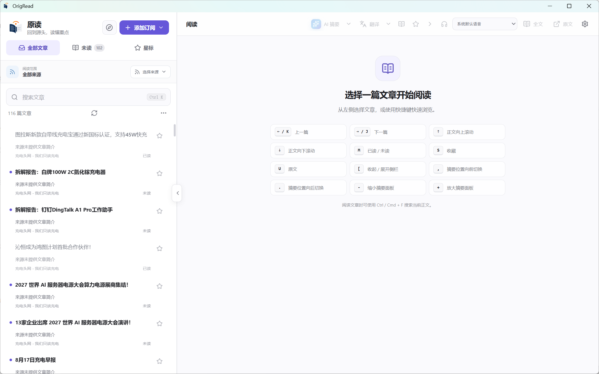
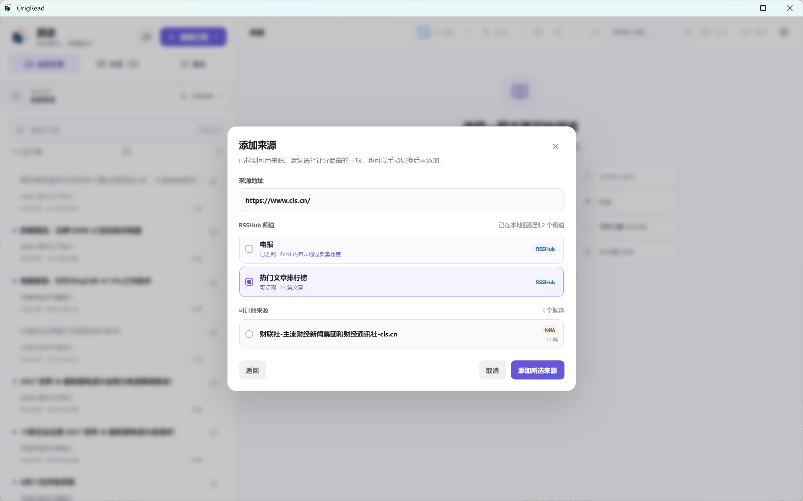
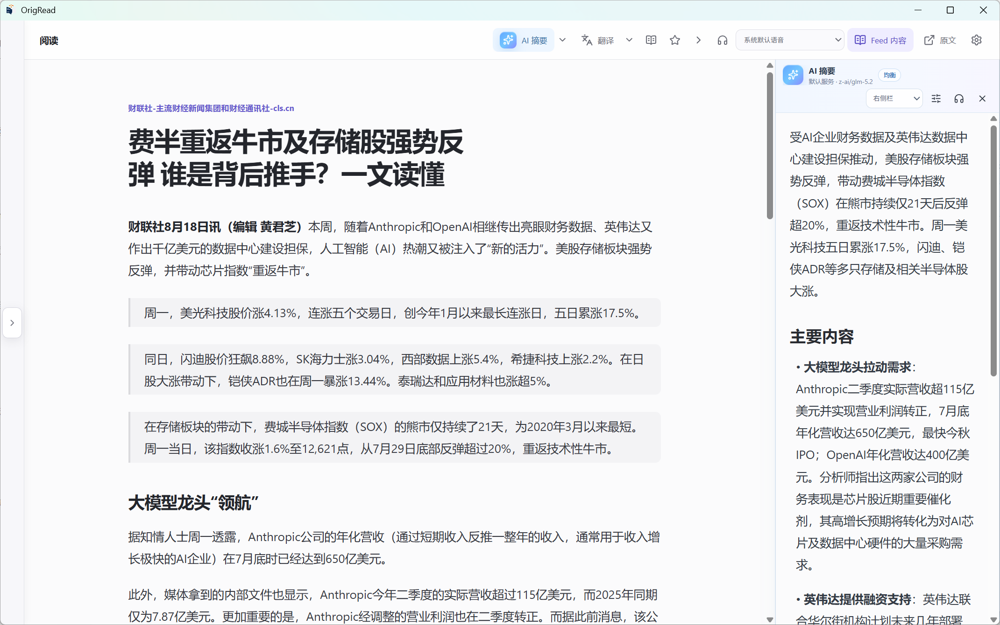
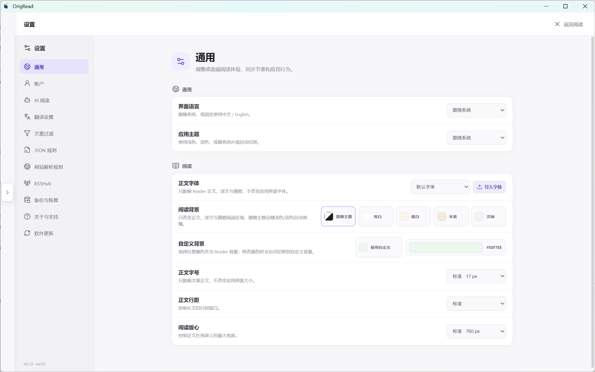

# 原读 Desktop（OrigRead Desktop）

<div align="center">
  <a href="README.md">English</a> |
  <a href="README-zh-CN.md">简体中文</a>
</div>

<div align="center">
  
</div>

<div align="center">
  <strong>一个以“来源优先”为核心的 Windows、macOS 与 Linux RSS / Feed / 新闻与个人信息阅读器。</strong>
</div>

<div align="center">
  RSS / Atom · RSSHub · 网页解析 · JSON/API · 全文阅读 · 翻译 · AI 摘要 · OPML
</div>

<div align="center">
  
  
  
  
  <a href="LICENSE"></a>
  
  
</div>

## 原读 Desktop 是什么？

原读 Desktop 是 **OrigRead / 原读** 的独立桌面客户端。它不把算法推荐作为信息入口，而是让用户自己决定**订阅什么来源、用什么方式读取、哪些内容需要过滤，以及什么时候使用翻译或 AI**。

除了传统 RSS / Atom，原读还可以从 RSSHub、普通网页、JSON/API、WordPress REST、Next.js / Nuxt 数据中发现内容；对于必须执行 JavaScript 才能看到文章列表的网站，静态方式失败后还可以使用受限 Chromium 做最后兜底。

目标很直接：**把你主动选择的来源集中到一个时间线里，尽可能提供干净可读的正文，同时始终保留原始网页。**

## 为什么做原读？

- **来源优先，而不是推荐优先**：时间线只来自你主动添加的来源。
- **不只接受 RSS 地址**：可以直接粘贴网站首页、文章列表页、Feed、API 等地址，让应用判断可用方式。
- **解析失败有退路**：RSS、RSSHub、JSON/API、网页解析和动态页面可以作为不同候选，而不是一种方式失败就彻底结束。
- **全文和原文都保留**：适合阅读时用提取后的正文；需要确认排版、评论或交互内容时随时打开原网页。
- **AI 只是辅助工具**：AI 用于摘要和全文翻译，不参与普通来源解析，也不会把阅读器变成聊天客户端。
- **适合长期整理自己的来源**：分组、过滤、规则、OPML、完整配置备份和远端账户同步都围绕“自己的信息源”展开。

## 软件截图

<p align="center"></p>

| 添加来源 | 阅读与 AI | 设置 |
| --- | --- | --- |
|  |  |  |

## 文档与其他平台

| 📖 操作手册 | 📱 Android 版本 |
| --- | --- |
| [查看 Desktop 操作手册](USER_GUIDE-zh-CN.md)，按“添加来源、阅读、AI/翻译、同步、迁移、故障处理”等实际任务查找。 | [前往 OrigRead Android](https://github.com/ZGMFX01A/OrigRead)，适用于 Android 手机和平板。 |

Android 与 Desktop 独立发布、分别安装；两端共享 OrigRead 的产品方向，并尽量保持来源、规则和配置备份的使用体验兼容。

## 来源发现：粘贴网址，而不只是粘贴 RSS

添加来源时，原读会根据输入地址尝试多种方式，并把实际可用的结果作为候选展示：

```text
输入 URL
  ↓
RSS / Atom
  ↓
RSSHub
  ↓
JSON / API / WordPress / Next.js / Nuxt
  ↓
网站解析规则 / 自动网页列表识别
  ↓
必要时使用动态 Chromium 兜底
  ↓
选择可用候选并订阅
```

### RSS / Atom

支持直接 Feed，也会从普通网页中发现声明的 RSS/Atom 地址，并尝试常见 Feed 路径。

### RSSHub

原读内置 RSSHub 路由目录，可以先判断“这个网站有没有对应 RSSHub 路由”，再尝试已启用的公共或自建实例。路由匹配成功和实例当前可用是两件事，所以公共实例临时超时不会被误报成“没有 RSSHub 路由”。

### 网页解析

没有可用 Feed 时，可以通过 Website Rule 或自动网页列表识别，把稳定的文章列表页变成来源。网站改版后规则可能失效，因此原读始终保留其他候选和原网页入口。

### 动态 Chromium 兜底

有些网站必须执行 JavaScript 后才出现文章列表。只有静态方式没有得到可用结果时，原读才会启动动态页面兜底。

**网页能打开不等于可以订阅。** 动态页面仍然需要真正识别出可用文章链接；如果没有提取到文章，不会创建一个空来源。

### JSON/API

对于公开 REST/JSON、WordPress 或稳定结构化数据，可以使用自动识别或 JSON/API Rule。它和普通网页规则是两套独立方式，方便在网站有稳定 API 时优先使用结构化数据。

## 全文阅读与原网页

原读提供三种常见阅读内容：

- **来源正文**：RSS/Atom/JSON 自己提供的内容。
- **全文**：访问文章页面后提取出的可读正文。
- **原文**：真实网站页面，通过应用内网页视图打开。

全文提取不依赖 AI。原读会优先使用规则、Readability 风格提取和页面结构化信息；动态正文必要时再使用浏览器渲染。无论提取结果如何，原始链接始终保留。

## 阅读体验

- 来源、分组、未读和收藏筛选。
- 文章搜索与正文内 `Ctrl/Cmd + F`。
- 已读 / 未读、收藏、上一篇 / 下一篇。
- 本地字体导入和阅读字体切换。
- 浅色、深色、跟随系统以及阅读背景色。
- 正文、译文和 AI 摘要分别朗读。
- AI 摘要可以替换正文，也可以停靠在左、右、上、下并调整大小。
- 键盘阅读快捷键，完整列表见 [Desktop 操作手册](USER_GUIDE-zh-CN.md#键盘快捷键)。

## 账户与同步

原读 Desktop 支持多账户：

- **Local**：所有数据保存在本机，可使用 RSS、RSSHub、Website、JSON/API 等全部原读来源类型。
- **FreshRSS / Google Reader Compatible**：同步远端订阅、分组、文章、已读和收藏状态。
- **Fever Compatible**：同步 Fever 协议提供的 Feed、文章、未读和收藏能力。

Website、JSON/API 和 RSSHub 是原读自己的来源类型，因此只属于 Local 账户。远端账户会遵循对应服务真正支持的能力，不会把本地功能伪装成远端协议功能。

## 翻译：传统服务与 AI 可以独立使用

不配置 LLM 也可以使用传统翻译服务：

- Microsoft Translator
- DeepL
- Google Cloud Translation
- DeepLX / DLX 兼容服务

也可以把 OpenAI Compatible 模型作为全文翻译方式。阅读时可以切换原文、译文或双语内容，长文章会自动分段处理。

## AI 阅读辅助

AI 是可选能力，只有配置并主动使用时才会调用。

- 支持多个 OpenAI Compatible 服务。
- 每个服务可使用独立 Endpoint、API Key 和模型。
- 支持速览、均衡、深入三种摘要档位。
- 摘要和文章内容绑定缓存，正文变化后不会继续误用旧摘要。
- 生成时显示实际处理阶段和已等待时间，并支持停止当前请求。
- 可以临时换 Provider、模型和摘要档位，不必修改全局默认设置。

> **AI 生成 JSON 规则 / AI 生成网站解析规则目前尚未完成。** 当前入口保持禁用，不把实验代码作为正式功能宣传。

## 规则与过滤

### Website Rule

适合结构稳定的 HTML 文章列表。可以指定文章卡片、标题、链接、时间等选择器。

### JSON/API Rule

适合稳定的 REST/JSON 或其他结构化数据。规则与 Website Rule 分开管理，避免把两种数据模型混在一起。

### 文章过滤

可以按标题关键词或正则过滤新文章。过滤在新文章进入正常时间线前执行；新建规则不会反向删除已经保存的历史文章。

## OPML、备份与迁移

- **OPML**：用于和其他 RSS 阅读器交换订阅。
- **原读完整配置备份**：用于迁移订阅、分组、Website/JSON 规则、过滤规则、RSSHub、阅读偏好、翻译和 AI 配置等原读专属内容。

敏感凭据默认不进入完整配置备份。只有主动选择包含凭据并设置备份密码时，才会生成可迁移的加密凭据数据。

## 软件更新

GitHub 版本可以检查 OrigRead Desktop Releases，并根据当前系统选择 Windows、macOS 或 Linux 安装包。更新检查失败不会阻止应用正常启动。

## 安全与隐私

- 普通 RSS、网页解析、规则匹配和正文提取不依赖 AI。
- AI 和云翻译只有在用户主动使用对应功能时才发送当前内容。
- 远程网页不会直接获得 Node.js / Electron 高权限。
- 原读不会绕过登录、验证码、付费墙或网站访问控制。
- 完整配置备份默认不导出敏感凭据。

## 下载与平台

正式版本通过 [GitHub Releases](https://github.com/ZGMFX01A/OrigRead-Desktop/releases) 发布。

计划/支持的桌面平台：

- Windows 10 / 11 x64
- macOS 13+（Apple Silicon）
- Linux x64（AppImage；Ubuntu/Debian 可使用 DEB）

## 从源码构建

环境要求：Node.js 24+、npm 11+。

```bash
npm ci
npm run typecheck
npm test
npm run build
```

打包：

```bash
npm run package:win
npm run package:mac -- --arm64
npm run package:linux -- --x64
```

## 项目关系与开源协议

OrigRead Desktop 与 [OrigRead Android](https://github.com/ZGMFX01A/OrigRead) 属于同一产品方向，但代码仓库和发布流程彼此独立。

Desktop 使用 **GNU Affero General Public License v3.0 only（AGPL-3.0-only）**，详见 [`LICENSE`](LICENSE)。

## 相关链接

- Desktop 仓库：https://github.com/ZGMFX01A/OrigRead-Desktop
- 版本发布：https://github.com/ZGMFX01A/OrigRead-Desktop/releases
- 问题反馈：https://github.com/ZGMFX01A/OrigRead-Desktop/issues
- Android 版本：https://github.com/ZGMFX01A/OrigRead
- 操作手册：[简体中文](USER_GUIDE-zh-CN.md) · [English](USER_GUIDE.md)

## Star History

<a href="https://www.star-history.com/?repos=ZGMFX01A%2FOrigRead-Desktop&type=timeline&logscale=&legend=top-left">
 <picture>
   <source media="(prefers-color-scheme: dark)" srcset="https://api.star-history.com/chart?repos=ZGMFX01A/OrigRead-Desktop&type=timeline&theme=dark&logscale&legend=top-left&sealed_token=9yvZTezWRptvx7uH1yBQewjMuH6m_RkPmRhxuhTr3gCap3szSQY2yEuM0Yoc9uN5ZPr6dwgFU754Grus68KOrSEa8qx5QNqEGkVVlFb4H3-t_dIgUEl2xpnzrkCYUgVlqmeumlDMHVbkchqNX0BmsIKXk6b2dQc2veu09IzN6XO2SAks_MTwdl4dUt_L" />
   <source media="(prefers-color-scheme: light)" srcset="https://api.star-history.com/chart?repos=ZGMFX01A/OrigRead-Desktop&type=timeline&logscale&legend=top-left&sealed_token=9yvZTezWRptvx7uH1yBQewjMuH6m_RkPmRhxuhTr3gCap3szSQY2yEuM0Yoc9uN5ZPr6dwgFU754Grus68KOrSEa8qx5QNqEGkVVlFb4H3-t_dIgUEl2xpnzrkCYUgVlqmeumlDMHVbkchqNX0BmsIKXk6b2dQc2veu09IzN6XO2SAks_MTwdl4dUt_L" />
   
 </picture>
</a>

## 搜索关键词

桌面 RSS 阅读器、Windows RSS 阅读器、macOS RSS 阅读器、Linux RSS 阅读器、Ubuntu RSS 阅读器、Feed 阅读器、新闻阅读器、个人信息阅读器、RSSHub 客户端、RSSHub Desktop、RSS 来源发现、网页转 RSS、网页订阅、Website Parser、HTML Parser、JSON API 阅读器、WordPress 阅读器、Next.js 阅读器、Nuxt 阅读器、Chromium 动态网页解析、全文 RSS、Readability、OPML、FreshRSS 客户端、Google Reader API 客户端、Fever 客户端、AI RSS 阅读器、AI 文章摘要、文章总结、AI 翻译、OpenAI Compatible、DeepL、DeepLX、Electron RSS Reader、来源优先阅读器。
