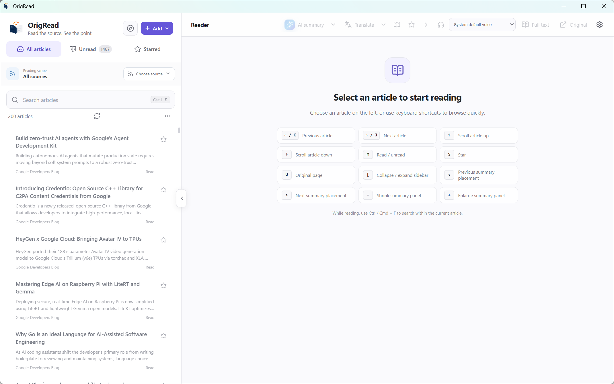
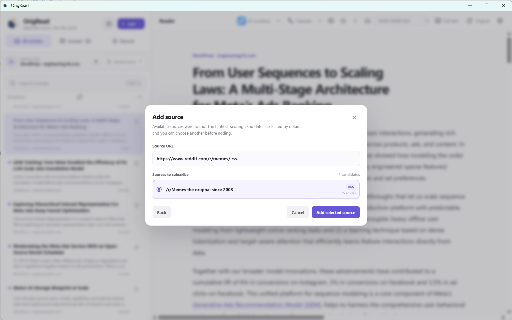
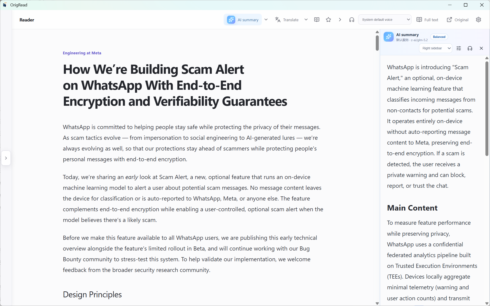
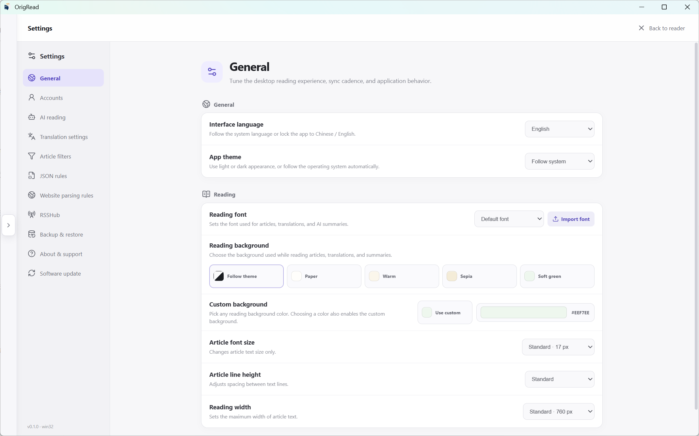

# OrigRead Desktop

<div align="center">
  <a href="README.md">English</a> |
  <a href="README-zh-CN.md">简体中文</a>
</div>

<div align="center">
  
</div>

<div align="center">
  <strong>A source-first RSS, feed, news and personal information reader for Windows, macOS and Linux.</strong>
</div>

<div align="center">
  RSS / Atom · RSSHub · Website parsing · JSON/API · Full-text reading · Translation · AI summaries · OPML
</div>

<div align="center">
  
  
  
  
  <a href="LICENSE"></a>
  
  
</div>

## What is OrigRead Desktop?

OrigRead Desktop is the standalone desktop client for **OrigRead**. Instead of building the reading experience around algorithmic recommendations, it lets you decide **which sources to follow, how to read them, what to filter, and when translation or AI should be used**.

Beyond RSS and Atom, OrigRead can discover content through RSSHub, ordinary websites, JSON/API endpoints, WordPress REST, and data embedded by Next.js or Nuxt. If a website only reveals its article list after JavaScript runs, a restricted Chromium fallback can be used after static methods fail.

The goal is simple: **bring the sources you deliberately follow into one timeline, provide readable full text whenever possible, and always preserve the original webpage.**

## Why OrigRead ?

- **Source-first, not recommendation-first** — your timeline comes from sources you explicitly add.
- **Paste websites, not only feed URLs** — homepage, article-list, feed and API URLs can all be inspected for usable subscription methods.
- **Multiple fallback paths** — RSS, RSSHub, JSON/API, website parsing and dynamic pages can compete as candidates instead of one failed parser ending the process.
- **Keep both readable text and the original page** — use extracted full text for reading and open the real webpage whenever layout, comments or interactive content matter.
- **AI stays optional** — AI is used for summaries and full-article translation, not for normal source parsing.
- **Built for a long-lived personal source library** — groups, filters, rules, OPML, configuration backup and remote accounts all support the same source-first workflow.

## Screenshots

<p align="center"></p>

| Source discovery | Reading & AI | Settings |
| --- | --- | --- |
|  |  |  |

## Documentation and other platforms

| 📖 User guide | 📱 Android edition |
| --- | --- |
| [Open the Desktop user guide](USER_GUIDE.md) for task-based instructions on adding sources, reading, AI/translation, sync, migration and troubleshooting. | [Open OrigRead Android](https://github.com/ZGMFX01A/OrigRead) for Android phones and tablets. |

Android and Desktop are released and installed separately. They share the OrigRead product direction and aim to keep source, rule and configuration-backup workflows compatible where practical.

## Source discovery: paste a URL, not just an RSS feed

When you add a source, OrigRead tries several methods and presents the usable results as candidates:

```text
Input URL
  ↓
RSS / Atom
  ↓
RSSHub
  ↓
JSON / API / WordPress / Next.js / Nuxt
  ↓
Website rules / automatic article-list detection
  ↓
Restricted Chromium fallback when needed
  ↓
Choose a usable candidate and subscribe
```

### RSS / Atom

Direct feeds are supported, and ordinary webpages can be inspected for declared RSS/Atom links and common feed endpoints.

### RSSHub

OrigRead ships with a local RSSHub route catalog. It can first determine whether a website matches a route, then try enabled public or self-hosted instances. Route matching and current instance availability are separate, so a temporary public-instance failure is not reported as “no RSSHub route”.

### Website parsing

When there is no usable feed, a Website Rule or automatic article-list detection can turn a stable chronological page into a source. Website layouts can change, so OrigRead keeps alternative candidates and the original webpage available.

### Restricted Chromium fallback

Some sites only create the article list after JavaScript runs. OrigRead starts the dynamic fallback only when static methods do not produce a usable candidate.

**A page loading successfully does not make it subscribable.** OrigRead still needs to extract usable article links; an empty rendered page is not turned into a fake source.

### JSON/API

Public REST/JSON, WordPress and other stable structured endpoints can be used through automatic discovery or JSON/API Rules. Structured data stays separate from Website Rules so a stable API can be preferred over fragile page selectors.

## Full-text reading and original pages

OrigRead commonly exposes three forms of article content:

- **Source content** — content supplied directly by RSS/Atom/JSON.
- **Full text** — readable content extracted after fetching the article page.
- **Original page** — the real webpage opened inside the app.

Full-text extraction does not depend on AI. Rules, Readability-style extraction and structured page metadata are tried first; browser rendering can be used for dynamic content when necessary. The original link is always preserved.

## Reading experience

- Source, group, unread and starred filtering.
- Article search and in-article `Ctrl/Cmd + F`.
- Read/unread, star/unstar and previous/next article controls.
- Local font import and reader font selection.
- Light, dark and system themes plus reader background colors.
- Separate text-to-speech for article text, translation and AI summary.
- AI summaries can replace the article or dock to the left, right, top or bottom with adjustable size.
- Keyboard reading shortcuts; see the full list in the [Desktop user guide](USER_GUIDE.md#keyboard-shortcuts).

## Accounts and sync

OrigRead Desktop supports multiple account types:

- **Local** — all data stays local and all OrigRead source types are available, including RSS, RSSHub, Website and JSON/API.
- **FreshRSS / Google Reader Compatible** — sync subscriptions, groups, articles, read state and starred state through the Google Reader API family.
- **Fever Compatible** — sync the feeds, articles, unread state and saved/starred state exposed by the Fever protocol.

Website, JSON/API and RSSHub are OrigRead-specific source types, so they belong to Local accounts. Remote accounts follow the capabilities of the actual remote protocol instead of pretending local-only features exist remotely.

## Translation: traditional providers and AI are independent

You can use traditional translation providers without configuring an LLM:

- Microsoft Translator
- DeepL
- Google Cloud Translation
- DeepLX / DLX-compatible services

OpenAI-compatible models can also be used for full-article translation. The reader can switch between original, translated or bilingual content, and long articles are processed in bounded chunks.

## AI reading features

AI is optional and is called only after you configure and invoke it.

- Multiple OpenAI-compatible providers.
- Separate endpoint, API key and models per provider.
- Brief, standard and detailed summary modes.
- Content-bound summary caching so changed article text does not keep an obsolete summary.
- Visible processing stage and elapsed time, plus explicit cancellation.
- Temporary provider/model/summary-mode selection without overwriting global defaults.

> **AI-generated JSON rules and AI-generated Website Rules are not finished.** Their entries remain disabled and are not advertised as released features.

## Rules and filters

### Website Rules

Use Website Rules for stable HTML article lists. Rules can describe article cards, titles, links, dates and other fields.

### JSON/API Rules

Use JSON/API Rules for stable REST/JSON or other structured data. They are managed separately from Website Rules so the two data models do not get mixed together.

### Article filters

New articles can be filtered by title keyword or regular expression before they enter the normal timeline. Creating a filter does not retroactively delete historical articles.

## OPML, backup and migration

- **OPML** — exchange subscriptions with other RSS/feed readers.
- **OrigRead configuration backup** — migrate subscriptions, groups, Website/JSON rules, filters, RSSHub settings, reader preferences, translation and AI configuration.

Sensitive credentials are excluded from configuration backup by default. They are exported only when you explicitly include them and protect the backup with a password.

## Software updates

GitHub builds can check OrigRead Desktop Releases and choose the installer for the current operating system. A failed update check does not block normal application startup.

## Security and privacy

- Normal RSS parsing, website parsing, rule matching and full-text extraction do not require AI.
- AI and cloud translation receive article content only when you invoke the corresponding feature.
- Remote webpages do not receive Node.js or Electron privileges.
- OrigRead does not bypass login walls, CAPTCHA, paywalls or website access controls.
- Configuration backups exclude sensitive credentials by default.

## Downloads and platforms

Official builds are published through [GitHub Releases](https://github.com/ZGMFX01A/OrigRead-Desktop/releases).

Target desktop platforms:

- Windows 10 / 11 x64
- macOS 13+ on Apple Silicon
- Linux x64 via AppImage, with DEB for Ubuntu/Debian systems

## Build from source

Requirements: Node.js 24+ and npm 11+.

```bash
npm ci
npm run typecheck
npm test
npm run build
```

Packaging:

```bash
npm run package:win
npm run package:mac -- --arm64
npm run package:linux -- --x64
```

## Project relationship and license

OrigRead Desktop and [OrigRead Android](https://github.com/ZGMFX01A/OrigRead) belong to the same product family, but their codebases and release pipelines are independent.

Desktop is distributed under the **GNU Affero General Public License v3.0 only (AGPL-3.0-only)**. See [`LICENSE`](LICENSE).

## Links

- Desktop repository: https://github.com/ZGMFX01A/OrigRead-Desktop
- Releases: https://github.com/ZGMFX01A/OrigRead-Desktop/releases
- Issues: https://github.com/ZGMFX01A/OrigRead-Desktop/issues
- Android edition: https://github.com/ZGMFX01A/OrigRead
- User guide: [English](USER_GUIDE.md) · [简体中文](USER_GUIDE-zh-CN.md)

## Star History

<a href="https://www.star-history.com/?repos=ZGMFX01A%2FOrigRead-Desktop&type=timeline&logscale=&legend=top-left">
 <picture>
   <source media="(prefers-color-scheme: dark)" srcset="https://api.star-history.com/chart?repos=ZGMFX01A/OrigRead-Desktop&type=timeline&theme=dark&logscale&legend=top-left&sealed_token=9yvZTezWRptvx7uH1yBQewjMuH6m_RkPmRhxuhTr3gCap3szSQY2yEuM0Yoc9uN5ZPr6dwgFU754Grus68KOrSEa8qx5QNqEGkVVlFb4H3-t_dIgUEl2xpnzrkCYUgVlqmeumlDMHVbkchqNX0BmsIKXk6b2dQc2veu09IzN6XO2SAks_MTwdl4dUt_L" />
   <source media="(prefers-color-scheme: light)" srcset="https://api.star-history.com/chart?repos=ZGMFX01A/OrigRead-Desktop&type=timeline&logscale&legend=top-left&sealed_token=9yvZTezWRptvx7uH1yBQewjMuH6m_RkPmRhxuhTr3gCap3szSQY2yEuM0Yoc9uN5ZPr6dwgFU754Grus68KOrSEa8qx5QNqEGkVVlFb4H3-t_dIgUEl2xpnzrkCYUgVlqmeumlDMHVbkchqNX0BmsIKXk6b2dQc2veu09IzN6XO2SAks_MTwdl4dUt_L" />
   
 </picture>
</a>

## Search keywords

Desktop RSS reader, Windows RSS reader, macOS RSS reader, Linux RSS reader, Ubuntu RSS reader, feed reader, news reader, personal information reader, RSSHub client, RSSHub Desktop, RSS discovery, website to RSS, website subscription, Website Parser, HTML Parser, JSON API reader, WordPress reader, Next.js reader, Nuxt reader, Chromium dynamic page parsing, full-text RSS, Readability, OPML, FreshRSS client, Google Reader API client, Fever client, AI RSS reader, AI article summary, AI translation, OpenAI Compatible, DeepL, DeepLX, Electron RSS Reader, source-first reader.
