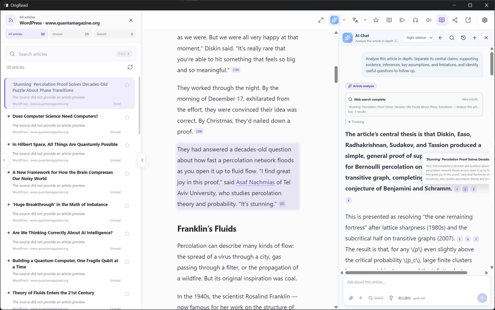

<div align="center">
  
  <h1>OrigRead Desktop · 原读</h1>
  <p><strong>Read what matters to you. Stay close to the source.</strong></p>
  <p>A reader for Windows, macOS, and Linux that brings your feeds, full articles, and AI reading tools together.</p>
  <p>English · <a href="README-zh-CN.md">简体中文</a></p>
  <p>
    <a href="https://github.com/ZGMFX01A/OrigRead-Desktop/releases/latest"></a>
    
    
    
    <a href="LICENSE"></a>
    
    <a href="https://github.com/ZGMFX01A/OrigRead-Desktop/stargazers"></a>
  </p>
  <p>
    <a href="https://github.com/ZGMFX01A/OrigRead-Desktop/releases/latest"><strong>Download for desktop</strong></a> ·
    <a href="USER_GUIDE.md">User guide</a> ·
    <a href="https://github.com/ZGMFX01A/OrigRead">Android app</a> ·
    <a href="https://github.com/ZGMFX01A/OrigRead-Desktop/issues">Report an issue</a>
  </p>
</div>

## A place for the things you want to read

Your favorite blogs, the news you follow, that occasional column worth waiting for—all in one place. OrigRead brings your chosen sources into a timeline you can read at your own pace.

On the desktop, the article and AI can sit side by side. Read the original while asking questions, comparing reports, and checking citations. Hide the list to settle into a long piece, adjust the type and reading width, or copy an article into your notes. **The original stays within reach, from the first headline to the next question.**

<p align="center">
  
  <br /><sub>Article and AI together · Read a conclusion, check its source</sub>
</p>

## Citation: see the evidence behind an answer

An AI answer can leave you with another question: did the author really say that? What was the context? Do these two reports rely on the same evidence? Citation connects answers to the original passages, making verification part of reading.

**Follow a citation to the author's words.** Click an article reference to locate and highlight the relevant text. If the evidence comes from another attached article, OrigRead can open it while keeping the discussion available. With the article and answer in the same window, you can check the context and keep asking questions.

For example, attach two reports about the same event and ask, “Where do their accounts differ?” Follow the references to see whether the disagreement comes from facts, perspective, or wording. **AI helps organize the evidence; citations let you judge it for yourself.**

Saved answers retain the sources used at the time. Changing attachments later does not replace an old answer's evidence. Search and tool results also retain their sources. If an article changes or a reference can no longer be located, inspect its source information. A citation does not guarantee that AI has interpreted the text correctly.

See the [Citation chapter](USER_GUIDE.md#citation-check-an-answers-evidence) for a walkthrough.

## Follow sites beyond RSS

A favorite site without a subscribe button does not always need another daily browser visit. **OrigRead can turn regularly updated website content into a source you can follow.** Paste a home or section URL to look for RSS / Atom and matching RSSHub routes. When there is no ready-made feed, OrigRead can look for article lists in web pages and public JSON/API data. This includes WordPress article APIs and data embedded in some Next.js and Nuxt pages.

You do not need to choose a parsing method upfront. OrigRead checks article counts, titles, links, and dates to rank the candidates, then lets you choose the section you actually want. Browser rendering offers another way to try pages whose articles appear only after scripts run.

For sites that need special handling, parsing rules tell OrigRead where to find articles. Import or export rules, or ask AI to help create one, then **inspect the articles it actually finds before saving**. Routine discovery and parsing need no AI setup. Reliable updates still depend on the site's access conditions and structure; a redesign may require a rule update.

Browse the built-in source directory for something new, or import OPML to bring your subscriptions. See the [user guide](USER_GUIDE.md#add-a-source) for adding sources and handling parsing problems.

<table>
  <tr><th width="50%">Find the section you want</th><th width="50%">Make reading comfortable</th></tr>
  <tr>
    <td align="center"></td>
    <td align="center"></td>
  </tr>
</table>

## From finding an article to understanding it

### Give long articles room

When a feed supplies only an excerpt, try fetching full text. Open the original website inside the app for comments, charts, or interactive content. Adjust fonts, size, background, and reading width, or import a local font you enjoy reading.

Place AI on either side of the article and drag the edge to resize it. Keyboard controls cover common actions such as moving between articles, starring, searching, and entering focus reading.

### Read it, understand it, keep it

Read translated text or a bilingual view using Microsoft Translator, DeepL, Google Cloud, a DeepLX / DLX-compatible service, or an AI model. Switch to TTS when you would rather listen.

Share an article as Markdown on the clipboard, optionally including its body and any translation or summary currently open. The original URL stays attached. Paste it into your notes so the source is still there when you return to it.

### Let AI follow your reading

Start a long article with a summary, ask about the current article, or select a passage to discuss. Attach related articles to compare perspectives. Use web search when you need background or recent developments.

OrigRead supports OpenAI-compatible cloud providers, self-hosted services, and local model services. Quick Messages save recurring questions, Skills preserve reusable methods, and Custom Instructions hold response preferences. Remote and local MCP services can supply additional tools, with confirmation before tool execution.

Configure these as they become useful. Everyday subscriptions, extraction, and reading work without AI. See the [AI, search, and tools guide](AI_MCP_SKILLS.md) for advanced setup.

## Download and get started

Choose a package for your system from [GitHub Releases](https://github.com/ZGMFX01A/OrigRead-Desktop/releases/latest):

| System | Package |
| --- | --- |
| Windows 11 · x64 | `.exe` installer |
| macOS 13+ · Apple Silicon | `.dmg` |
| Linux · x64 | `.AppImage`; Ubuntu / Debian can also use `.deb` |

Keep the default Local account, add a source or import OPML, and start reading. The app can check for updates. See [installation and updates](USER_GUIDE.md#installation-and-updates) if you need help installing.

For phones and tablets, visit [OrigRead Android](https://github.com/ZGMFX01A/OrigRead). Android and desktop install and update independently. The [migration guide](USER_GUIDE.md#opml-backup-and-migration) explains what you can move between them.

## Your subscriptions, in your hands

A Local account stores data on your computer and supports Website, JSON/API, and RSSHub sources. If you already use FreshRSS, a Google Reader-compatible service, or a Fever-compatible service, connect that account to sync the subscriptions and reading states it supports.

Routine parsing, full-text extraction, and filtering run locally. AI and cloud translation send relevant content to the service you configure. Configuration backups carry subscriptions, rules, and settings. Credentials are excluded by default and can be included in a password-encrypted export. **Configuration backups exclude article bodies, read and starred history, and summary and translation caches.**

## Feedback and discussion

Found a problem or have an idea? [Open an issue](https://github.com/ZGMFX01A/OrigRead-Desktop/issues). For parsing problems, include the URL, app version, and steps to reproduce. The project currently does not accept pull requests; use issues for feature suggestions, translation corrections, and documentation feedback too.

<details>
<summary>Build from source</summary>

Requirements: Node.js 24+ and npm 11+.

```bash
npm ci
npm run typecheck
npm test
npm run build
```

Package for the target platform:

```bash
npm run package:win
npm run package:mac
npm run package:linux
```

See [package.json](package.json) and [electron-builder.yml](electron-builder.yml) for build scripts and package settings.

</details>

## Project relationship and license

OrigRead Desktop and [OrigRead Android](https://github.com/ZGMFX01A/OrigRead) share a product direction, with independent repositories and releases. Thank you to everyone who helps with feedback, translations, and code.

Desktop is distributed under the **GNU Affero General Public License v3.0 only (AGPL-3.0-only)**. See [LICENSE](LICENSE).

## Star history

<a href="https://www.star-history.com/?repos=ZGMFX01A%2FOrigRead-Desktop&type=timeline&logscale=&legend=top-left">
 <picture>
   <source media="(prefers-color-scheme: dark)" srcset="https://api.star-history.com/chart?repos=ZGMFX01A/OrigRead-Desktop&type=timeline&theme=dark&logscale&legend=top-left&sealed_token=9yvZTezWRptvx7uH1yBQewjMuH6m_RkPmRhxuhTr3gCap3szSQY2yEuM0Yoc9uN5ZPr6dwgFU754Grus68KOrSEa8qx5QNqEGkVVlFb4H3-t_dIgUEl2xpnzrkCYUgVlqmeumlDMHVbkchqNX0BmsIKXk6b2dQc2veu09IzN6XO2SAks_MTwdl4dUt_L" />
   <source media="(prefers-color-scheme: light)" srcset="https://api.star-history.com/chart?repos=ZGMFX01A/OrigRead-Desktop&type=timeline&logscale&legend=top-left&sealed_token=9yvZTezWRptvx7uH1yBQewjMuH6m_RkPmRhxuhTr3gCap3szSQY2yEuM0Yoc9uN5ZPr6dwgFU754Grus68KOrSEa8qx5QNqEGkVVlFb4H3-t_dIgUEl2xpnzrkCYUgVlqmeumlDMHVbkchqNX0BmsIKXk6b2dQc2veu09IzN6XO2SAks_MTwdl4dUt_L" />
   
 </picture>
</a>
